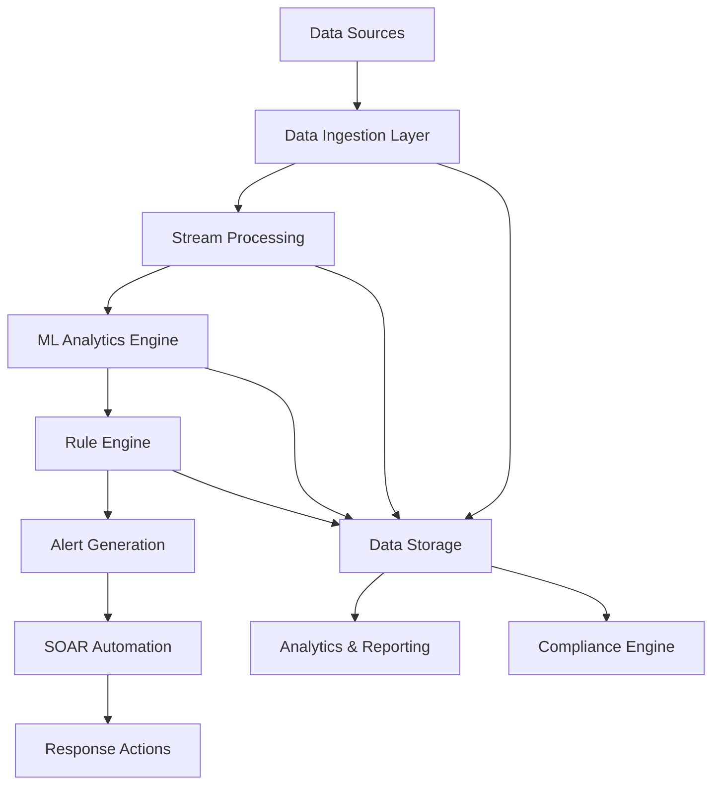

# IntelliGuard-AI: Technical Architecture Documentation
## Comprehensive System Design Specification

**Document Version:** 1.0  
**Last Updated:** September 2025  
**Classification:** Technical - Internal Use  
**Prepared for:** Technical Architecture Review Board

---

## Table of Contents

1. [Architecture Overview](#architecture-overview)
2. [System Components](#system-components)
3. [Data Flow Architecture](#data-flow-architecture)
4. [Integration Specifications](#integration-specifications)
5. [Deployment Architecture](#deployment-architecture)
6. [Security Architecture](#security-architecture)
7. [Performance Requirements](#performance-requirements)
8. [Scalability Design](#scalability-design)
9. [High Availability](#high-availability)
10. [Implementation Specifications](#implementation-specifications)

---

## Architecture Overview

### High-Level System Design

IntelliGuard-AI implements a microservices-based, cloud-native architecture designed for enterprise-scale cybersecurity operations. The system follows a layered architecture pattern with clear separation of concerns and standardized APIs between components.

#### Architecture Principles

**🏗️ Design Principles:**
- **Microservices Architecture** - Loosely coupled, independently deployable services
- **Event-Driven Processing** - Asynchronous communication and real-time data processing
- **API-First Design** - RESTful APIs with OpenAPI specifications
- **Container-Native** - Docker containers orchestrated with Kubernetes
- **Infrastructure as Code** - Terraform/Ansible for reproducible deployments
- **Observability-First** - Comprehensive monitoring, logging, and tracing

**🔧 Technical Standards:**
- **Container Runtime:** Docker Engine 20.10+
- **Orchestration:** Kubernetes 1.24+
- **Service Mesh:** Istio 1.15+ for service communication
- **Message Queue:** Apache Kafka 3.0+ for event streaming
- **Database:** PostgreSQL 14+ for structured data, Elasticsearch 8.0+ for logs
- **Cache:** Redis 7.0+ for session and application caching

### Logical Architecture Layers

```
┌─────────────────────────────────────────────────────────────────┐
│                    PRESENTATION LAYER                           │
├─────────────────────────────────────────────────────────────────┤
│  Web UI          API Gateway       Mobile Apps    Reports       │
│  (React)         (Kong/Istio)      (React Native) (Grafana)     │
└─────────────────────────────────────────────────────────────────┘
                                ↕ HTTPS/WSS
┌─────────────────────────────────────────────────────────────────┐
│                    APPLICATION LAYER                            │
├─────────────────────────────────────────────────────────────────┤
│  Authentication  Authorization   Workflow Engine   Notification │
│  (Keycloak)      (RBAC/ABAC)     (Shuffle)        (Email/Slack) │
└─────────────────────────────────────────────────────────────────┘
                                ↕ REST/GraphQL APIs
┌─────────────────────────────────────────────────────────────────┐
│                    BUSINESS LOGIC LAYER                         │
├─────────────────────────────────────────────────────────────────┤
│  SIEM Engine     SOAR Platform   ML Analytics    Case Mgmt      │
│  (Wazuh)         (Shuffle)       (TensorFlow)    (TheHive)      │
└─────────────────────────────────────────────────────────────────┘
                                ↕ Message Bus (Kafka)
┌─────────────────────────────────────────────────────────────────┐
│                    DATA PROCESSING LAYER                        │
├─────────────────────────────────────────────────────────────────┤
│  Stream Process  Batch Process   Data Pipeline   ETL Engine     │
│  (Kafka Streams) (Apache Spark)  (Apache Beam)  (Apache Airflow)│
└─────────────────────────────────────────────────────────────────┘
                                ↕ Data APIs
┌─────────────────────────────────────────────────────────────────┐
│                    DATA STORAGE LAYER                           │
├─────────────────────────────────────────────────────────────────┤
│  OLTP Database   OLAP Database   Search Engine   Object Storage │
│  (PostgreSQL)    (ClickHouse)    (Elasticsearch) (MinIO/S3)     │
└─────────────────────────────────────────────────────────────────┘
                                ↕ Network Protocols
┌─────────────────────────────────────────────────────────────────┐
│                    INFRASTRUCTURE LAYER                         │
├─────────────────────────────────────────────────────────────────┤
│  Container Platform    Service Mesh     Monitoring   Security   │
│  (Kubernetes)          (Istio)          (Prometheus) (Vault)    │
└─────────────────────────────────────────────────────────────────┘
```

---

## System Components

### Core Security Components

#### 1. Wazuh SIEM/XDR Platform

**Component Type:** Central Security Information and Event Management  
**Version:** Wazuh 4.5+  
**Deployment:** Distributed cluster architecture

**Technical Specifications:**
```yaml
wazuh_cluster:
  manager_nodes: 3
  worker_nodes: 6
  elasticsearch_nodes: 6
  kibana_nodes: 2
  
resource_requirements:
  manager:
    cpu: 4 cores
    memory: 8GB RAM
    storage: 100GB SSD
  worker:
    cpu: 8 cores
    memory: 16GB RAM
    storage: 500GB SSD
  elasticsearch:
    cpu: 8 cores
    memory: 32GB RAM
    storage: 2TB NVMe SSD

network_requirements:
  bandwidth: 10Gbps
  latency: <5ms internal
  ports:
    - 1514/udp  # Syslog
    - 1515/tcp  # Agent communication
    - 55000/tcp # API
```

**Key Capabilities:**
- Host-based intrusion detection (HIDS)
- Network intrusion detection (NIDS)
- File integrity monitoring (FIM)
- Log analysis and correlation
- Vulnerability detection
- Compliance monitoring (PCI DSS, GDPR, HIPAA)
- Active response automation

#### 2. Grafana Analytics Platform

**Component Type:** Visualization and Analytics Dashboard  
**Version:** Grafana Enterprise 9.0+  
**Deployment:** High-availability cluster

**Technical Specifications:**
```yaml
grafana_deployment:
  instances: 3
  load_balancer: nginx/haproxy
  
resource_requirements:
  cpu: 4 cores per instance
  memory: 8GB RAM per instance
  storage: 100GB SSD per instance
  
integrations:
  data_sources:
    - prometheus_metrics
    - elasticsearch_logs
    - postgresql_metadata
    - wazuh_api
  
plugins:
  - grafana-clock-panel
  - grafana-worldmap-panel
  - grafana-piechart-panel
  - grafana-flowcharting
```

**Dashboard Categories:**
- Executive KPI dashboards
- SOC analyst workstations
- Incident response dashboards
- Compliance reporting views
- Performance monitoring displays

#### 3. Prometheus Monitoring Stack

**Component Type:** Metrics collection and time-series database  
**Version:** Prometheus 2.37+, AlertManager 0.24+  
**Deployment:** Federated monitoring architecture

**Technical Specifications:**
```yaml
prometheus_stack:
  prometheus_servers: 2
  alertmanager_instances: 3
  pushgateway_instances: 2
  
resource_requirements:
  prometheus:
    cpu: 8 cores
    memory: 32GB RAM
    storage: 1TB SSD (retention: 15 days)
  alertmanager:
    cpu: 2 cores
    memory: 4GB RAM
    storage: 10GB SSD
    
metrics_collection:
  scrape_interval: 15s
  evaluation_interval: 15s
  retention_time: 15d
  external_storage: thanos/cortex
```

**Monitoring Targets:**
- Kubernetes cluster metrics
- Application performance metrics
- Infrastructure health metrics
- Security event metrics
- Business KPI metrics

### SOAR Integration Components

#### 4. Shuffle Workflow Automation

**Component Type:** Security Orchestration, Automation and Response  
**Version:** Shuffle 1.3+  
**Deployment:** Kubernetes-native deployment

**Technical Specifications:**
```yaml
shuffle_deployment:
  orborus_instances: 3
  worker_replicas: 10
  
resource_requirements:
  orborus:
    cpu: 2 cores
    memory: 4GB RAM
  worker:
    cpu: 1 core
    memory: 2GB RAM
    
workflow_capacity:
  concurrent_executions: 1000
  max_workflow_duration: 1h
  workflow_timeout: 30m
  
integrations:
  - wazuh_api
  - thehive_api
  - cortex_analyzers
  - email_smtp
  - slack_api
  - servicenow_api
```

**Automation Capabilities:**
- Incident response playbooks
- Threat hunting workflows
- Evidence collection automation
- Notification orchestration
- Remediation actions

#### 5. Cortex Observable Analysis

**Component Type:** Observable enrichment and analysis engine  
**Version:** Cortex 3.1+  
**Deployment:** Scalable analyzer cluster

**Technical Specifications:**
```yaml
cortex_deployment:
  analyzer_workers: 20
  responder_workers: 10
  
resource_requirements:
  api_server:
    cpu: 4 cores
    memory: 8GB RAM
  analyzer_worker:
    cpu: 2 cores
    memory: 4GB RAM
    
analyzers:
  threat_intelligence:
    - virustotal_analyzer
    - misp_analyzer
    - otx_analyzer
    - shodan_analyzer
  file_analysis:
    - file_info_analyzer
    - yara_analyzer
    - cuckoo_sandbox
  network_analysis:
    - dns_analyzer
    - whois_analyzer
    - geolocation_analyzer
```

#### 6. TheHive Case Management

**Component Type:** Collaborative incident response platform  
**Version:** TheHive 5.0+  
**Deployment:** Clustered deployment with Cassandra backend

**Technical Specifications:**
```yaml
thehive_deployment:
  application_nodes: 3
  cassandra_nodes: 3
  elasticsearch_nodes: 3
  
resource_requirements:
  application:
    cpu: 4 cores
    memory: 8GB RAM
  cassandra:
    cpu: 8 cores
    memory: 16GB RAM
    storage: 500GB SSD
    
features:
  - case_management
  - task_assignment
  - observable_tracking
  - timeline_analysis
  - reporting_engine
  - misp_integration
```

### AI/ML Analytics Components

#### 7. Machine Learning Pipeline

**Component Type:** AI-powered threat detection and analysis  
**Framework:** TensorFlow 2.9+, Scikit-learn 1.1+  
**Deployment:** GPU-accelerated compute cluster

**Technical Specifications:**
```yaml
ml_infrastructure:
  training_cluster:
    gpu_nodes: 4
    cpu_nodes: 8
  inference_cluster:
    gpu_nodes: 2
    cpu_nodes: 4
    
resource_requirements:
  training_node:
    cpu: 16 cores
    memory: 128GB RAM
    gpu: 4x NVIDIA A100
    storage: 2TB NVMe SSD
  inference_node:
    cpu: 8 cores
    memory: 64GB RAM
    gpu: 2x NVIDIA T4
    storage: 500GB SSD
    
ml_models:
  anomaly_detection:
    algorithm: isolation_forest
    training_frequency: daily
    inference_latency: <100ms
  behavioral_analysis:
    algorithm: lstm_neural_network
    training_frequency: weekly
    inference_latency: <500ms
  threat_classification:
    algorithm: gradient_boosting
    training_frequency: monthly
    inference_latency: <50ms
```

**ML Capabilities:**
- Real-time anomaly detection
- User and entity behavior analytics (UEBA)
- Threat hunting automation
- False positive reduction
- Risk scoring algorithms
- Predictive threat modeling

---

## Data Flow Architecture

### Real-Time Event Processing Pipeline



#### 1. Data Ingestion Layer

**Log Sources:**
```yaml
data_sources:
  network_devices:
    - firewalls (syslog, snmp)
    - switches (syslog, netflow)
    - routers (syslog, snmp)
    - load_balancers (syslog, api)
  
  endpoints:
    - windows_workstations (winlogbeat)
    - linux_servers (filebeat)
    - macos_devices (osquery)
    - mobile_devices (mdm_api)
  
  applications:
    - web_applications (apache/nginx logs)
    - databases (audit logs)
    - email_systems (exchange/postfix logs)
    - cloud_services (api logs)
  
  security_tools:
    - antivirus (alert feeds)
    - vulnerability_scanners (xml/json)
    - identity_systems (saml/oauth logs)
    - cloud_security (api feeds)
```

**Ingestion Protocols:**
- **Syslog (RFC 3164/5424)** - Network device logs
- **Beats Framework** - Endpoint log collection
- **API Polling** - Cloud service integration
- **File Monitoring** - Local log file parsing
- **Database Connections** - Direct database log extraction

#### 2. Stream Processing Architecture

**Technology Stack:**
```yaml
stream_processing:
  message_broker: apache_kafka
  processing_engine: kafka_streams
  schema_registry: confluent_schema_registry
  
kafka_configuration:
  brokers: 6
  partitions_per_topic: 12
  replication_factor: 3
  retention_period: 7d
  
topics:
  raw_events:
    throughput: 100k_msgs/sec
    partition_key: source_ip
  enriched_events:
    throughput: 80k_msgs/sec
    partition_key: event_type
  alerts:
    throughput: 1k_msgs/sec
    partition_key: severity
```

**Processing Stages:**
1. **Data Normalization** - Common Event Format (CEF) conversion
2. **Data Enrichment** - GeoIP, threat intelligence, asset context
3. **Data Correlation** - Cross-source event correlation
4. **Anomaly Detection** - ML-based pattern analysis
5. **Rule Evaluation** - Security rule engine processing
6. **Alert Generation** - Prioritized alert creation

#### 3. Data Storage Strategy

**Multi-Tier Storage Architecture:**
```yaml
storage_tiers:
  hot_tier:
    technology: elasticsearch
    retention: 30_days
    performance: <1s_query
    capacity: 10TB
  
  warm_tier:
    technology: elasticsearch_frozen
    retention: 365_days
    performance: <10s_query
    capacity: 100TB
  
  cold_tier:
    technology: object_storage
    retention: 7_years
    performance: <60s_query
    capacity: 1PB
  
  archive_tier:
    technology: glacier_storage
    retention: 10_years
    performance: <24h_restore
    capacity: unlimited
```

---

## Integration Specifications

### API Architecture

#### 1. RESTful API Design

**API Gateway Configuration:**
```yaml
api_gateway:
  technology: kong_enterprise
  deployment: kubernetes_ingress
  
endpoints:
  authentication:
    path: /api/v1/auth
    methods: [POST, DELETE]
    rate_limit: 100/min
  
  events:
    path: /api/v1/events
    methods: [GET, POST, PUT]
    rate_limit: 1000/min
    
  alerts:
    path: /api/v1/alerts
    methods: [GET, POST, PUT, DELETE]
    rate_limit: 500/min
    
  cases:
    path: /api/v1/cases
    methods: [GET, POST, PUT, DELETE]
    rate_limit: 200/min

security:
  authentication: jwt_tokens
  authorization: rbac_policies
  encryption: tls_1.3
  api_keys: required_for_external
```

#### 2. Integration Patterns

**Service Communication:**
```yaml
communication_patterns:
  synchronous:
    protocol: https_rest_api
    timeout: 30s
    retry_policy: exponential_backoff
    circuit_breaker: enabled
  
  asynchronous:
    protocol: kafka_messaging
    delivery_guarantee: at_least_once
    dead_letter_queue: enabled
    message_ordering: partition_key
  
  real_time:
    protocol: websockets
    heartbeat_interval: 30s
    connection_timeout: 5m
    max_connections: 10000
```

**External System Integrations:**
```yaml
external_integrations:
  threat_intelligence:
    - misp_platform
    - otx_alienvault
    - virustotal_api
    - crowdstrike_api
  
  itsm_platforms:
    - servicenow_api
    - jira_service_desk
    - remedy_api
    - freshservice_api
  
  communication:
    - slack_webhook
    - microsoft_teams
    - email_smtp
    - sms_gateway
  
  identity_providers:
    - active_directory
    - azure_ad
    - okta_saml
    - ping_identity
```

### Data Format Standards

#### Event Schema Definition

**Common Event Format (CEF):**
```json
{
  "timestamp": "2025-09-07T14:30:00.000Z",
  "source": {
    "ip": "192.168.1.100",
    "hostname": "workstation-01",
    "mac": "00:1B:44:11:3A:B7"
  },
  "destination": {
    "ip": "10.0.0.50",
    "port": 443,
    "service": "https"
  },
  "event": {
    "type": "network_connection",
    "category": "network",
    "severity": "medium",
    "action": "allowed"
  },
  "user": {
    "name": "john.doe",
    "domain": "corp.local",
    "groups": ["domain_users", "developers"]
  },
  "metadata": {
    "vendor": "cisco_asa",
    "product": "firewall",
    "version": "9.12"
  },
  "enrichment": {
    "geolocation": {
      "country": "US",
      "city": "New York",
      "coordinates": [40.7128, -74.0060]
    },
    "threat_intel": {
      "reputation": "clean",
      "categories": [],
      "confidence": 85
    }
  }
}
```

---

## Deployment Architecture

### Kubernetes Infrastructure

#### 1. Cluster Architecture

**Multi-Cluster Design:**
```yaml
cluster_topology:
  production_cluster:
    nodes: 20
    node_types:
      - master_nodes: 3
      - worker_nodes: 15
      - gpu_nodes: 2
    
    node_specifications:
      master:
        cpu: 8_cores
        memory: 32GB
        storage: 200GB_SSD
      worker:
        cpu: 16_cores
        memory: 64GB
        storage: 1TB_SSD
      gpu:
        cpu: 24_cores
        memory: 128GB
        gpu: 4x_nvidia_a100
        storage: 2TB_nvme
  
  staging_cluster:
    nodes: 6
    specifications: reduced_capacity
  
  development_cluster:
    nodes: 3
    specifications: minimal_capacity
```

#### 2. Namespace Organization

**Kubernetes Namespaces:**
```yaml
namespaces:
  security-core:
    components: [wazuh, elasticsearch, kibana]
    network_policies: strict_ingress_egress
    resource_quotas: high_priority
  
  soar-platform:
    components: [shuffle, cortex, thehive]
    network_policies: api_access_only
    resource_quotas: medium_priority
  
  analytics:
    components: [grafana, prometheus, ml_pipelines]
    network_policies: monitoring_access
    resource_quotas: medium_priority
  
  data-processing:
    components: [kafka, redis, data_pipelines]
    network_policies: internal_cluster_only
    resource_quotas: high_priority
```

#### 3. Service Mesh Configuration

**Istio Service Mesh:**
```yaml
istio_configuration:
  components:
    - istio_pilot
    - istio_gateway
    - istio_proxy
    - kiali_dashboard
  
  security_policies:
    - mutual_tls: STRICT
    - authorization_policies: namespace_based
    - network_policies: zero_trust
  
  observability:
    - distributed_tracing: jaeger
    - metrics_collection: prometheus
    - access_logging: enabled
  
  traffic_management:
    - load_balancing: round_robin
    - circuit_breaker: enabled
    - timeout: 30s
    - retry_policy: 3_attempts
```

### Infrastructure as Code

#### Terraform Configuration

**AWS Infrastructure:**
```hcl
# terraform/aws/main.tf
module "vpc" {
  source = "terraform-aws-modules/vpc/aws"
  
  name = "intelliguard-ai-vpc"
  cidr = "10.0.0.0/16"
  
  azs             = ["us-west-2a", "us-west-2b", "us-west-2c"]
  private_subnets = ["10.0.1.0/24", "10.0.2.0/24", "10.0.3.0/24"]
  public_subnets  = ["10.0.101.0/24", "10.0.102.0/24", "10.0.103.0/24"]
  
  enable_nat_gateway = true
  enable_vpn_gateway = true
  
  tags = {
    Environment = "production"
    Project     = "intelliguard-ai"
  }
}

module "eks" {
  source = "terraform-aws-modules/eks/aws"
  
  cluster_name    = "intelliguard-ai-cluster"
  cluster_version = "1.24"
  
  vpc_id     = module.vpc.vpc_id
  subnet_ids = module.vpc.private_subnets
  
  node_groups = {
    security_core = {
      desired_capacity = 6
      max_capacity     = 10
      min_capacity     = 3
      instance_types   = ["m5.2xlarge"]
    }
    
    analytics = {
      desired_capacity = 4
      max_capacity     = 8
      min_capacity     = 2
      instance_types   = ["r5.xlarge"]
    }
    
    ml_processing = {
      desired_capacity = 2
      max_capacity     = 4
      min_capacity     = 1
      instance_types   = ["p3.2xlarge"]
    }
  }
}
```

---

## Security Architecture

### Defense-in-Depth Strategy

#### 1. Network Security

**Network Segmentation:**
```yaml
network_security:
  perimeter_defense:
    - waf_protection: cloudflare_enterprise
    - ddos_protection: aws_shield_advanced
    - load_balancing: application_load_balancer
  
  internal_segmentation:
    - micro_segmentation: istio_network_policies
    - east_west_traffic: encrypted_service_mesh
    - zero_trust_model: identity_based_access
  
  monitoring:
    - network_flows: vpc_flow_logs
    - dns_monitoring: route53_resolver_logs
    - intrusion_detection: suricata_ids
```

#### 2. Application Security

**Security Controls:**
```yaml
application_security:
  authentication:
    - identity_provider: keycloak_oidc
    - multi_factor: totp_sms_email
    - session_management: jwt_tokens
  
  authorization:
    - access_control: rbac_abac
    - api_security: oauth2_scopes
    - fine_grained: resource_permissions
  
  data_protection:
    - encryption_at_rest: aes_256_gcm
    - encryption_in_transit: tls_1.3
    - key_management: hashicorp_vault
  
  secure_development:
    - code_scanning: sonarqube
    - dependency_checking: snyk
    - container_scanning: twistlock
```

#### 3. Infrastructure Security

**Security Hardening:**
```yaml
infrastructure_security:
  container_security:
    - base_images: distroless_minimal
    - vulnerability_scanning: continuous
    - runtime_protection: falco_runtime_security
    - admission_control: open_policy_agent
  
  kubernetes_security:
    - rbac_policies: least_privilege
    - pod_security: security_contexts
    - network_policies: default_deny
    - secrets_management: external_secrets_operator
  
  cloud_security:
    - iam_policies: minimal_permissions
    - resource_tagging: mandatory_compliance
    - audit_logging: cloudtrail_enabled
    - compliance_scanning: aws_config
```

---

## Performance Requirements

### Scalability Specifications

#### 1. Throughput Requirements

**Event Processing Capacity:**
```yaml
performance_targets:
  event_ingestion:
    peak_throughput: 500k_events/second
    sustained_throughput: 200k_events/second
    burst_capacity: 1M_events/second
    latency_p99: <500ms
  
  alert_processing:
    peak_throughput: 10k_alerts/second
    sustained_throughput: 5k_alerts/second
    processing_latency: <100ms
    false_positive_rate: <15%
  
  query_performance:
    search_latency_p95: <2s
    dashboard_load_time: <3s
    report_generation: <30s
    concurrent_users: 1000
```

#### 2. Resource Scaling

**Auto-Scaling Configuration:**
```yaml
scaling_policies:
  horizontal_scaling:
    - metric: cpu_utilization
      target: 70%
      min_replicas: 3
      max_replicas: 20
    
    - metric: memory_utilization
      target: 80%
      min_replicas: 3
      max_replicas: 15
    
    - metric: custom/queue_depth
      target: 1000_messages
      min_replicas: 2
      max_replicas: 50
  
  vertical_scaling:
    - enabled: true
      cpu_range: [100m, 4000m]
      memory_range: [128Mi, 8Gi]
      update_policy: auto
```

---

## High Availability

### Disaster Recovery

**RTO/RPO Specifications:**
```yaml
disaster_recovery:
  production_tier:
    rto: 1_hour
    rpo: 15_minutes
    backup_frequency: continuous
    replication: multi_region
  
  secondary_services:
    rto: 4_hours
    rpo: 1_hour
    backup_frequency: hourly
    replication: single_region
  
  backup_strategy:
    automated_backups: daily
    retention_policy: 90_days
    cross_region_backup: enabled
    backup_encryption: aes_256
```

### Fault Tolerance

**Resilience Design:**
```yaml
fault_tolerance:
  service_redundancy:
    - active_active: critical_services
    - active_passive: secondary_services
    - circuit_breakers: all_external_calls
    - bulkhead_pattern: resource_isolation
  
  data_redundancy:
    - replication_factor: 3
    - cross_az_replication: enabled
    - backup_verification: automated
    - point_in_time_recovery: enabled
```

---

## Implementation Specifications

### Technology Stack Summary

**Core Technologies:**
```yaml
technology_matrix:
  container_platform: kubernetes_1.24
  service_mesh: istio_1.15
  api_gateway: kong_enterprise_3.0
  message_broker: apache_kafka_3.2
  search_engine: elasticsearch_8.4
  time_series_db: prometheus_2.38
  relational_db: postgresql_14
  cache: redis_7.0
  workflow_engine: apache_airflow_2.4
  ml_framework: tensorflow_2.10
  
deployment_tools:
  infrastructure: terraform_1.3
  configuration: ansible_6.0
  container_registry: harbor_2.5
  ci_cd_pipeline: gitlab_ci_15.0
  monitoring: prometheus_grafana_stack
  logging: elk_stack_8.4
  tracing: jaeger_1.37
  
security_tools:
  secrets_management: hashicorp_vault_1.12
  image_scanning: twistlock_22.06
  vulnerability_mgmt: qualys_vmdr
  compliance_scanning: chef_inspec
```

### Development Standards

**Code Quality Standards:**
```yaml
development_standards:
  programming_languages:
    - python: 3.10+
    - golang: 1.19+
    - javascript: es2022
    - typescript: 4.8+
  
  code_quality:
    - test_coverage: >90%
    - code_complexity: cyclomatic <10
    - code_duplication: <3%
    - security_scanning: mandatory
  
  documentation:
    - api_documentation: openapi_3.0
    - code_documentation: inline_comments
    - architecture_docs: c4_model
    - runbooks: operational_procedures
```

This comprehensive technical architecture documentation provides the foundation for implementing IntelliGuard-AI with enterprise-grade reliability, security, and scalability. The next step would be to create detailed deployment guides and configuration templates based on these specifications.